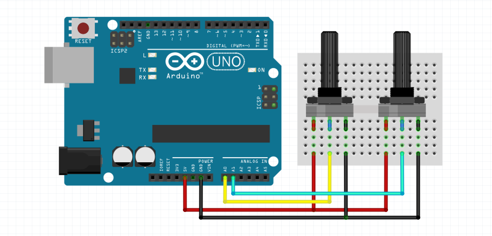

# WebSerial

> WebSerial is a minimal [Electron](https://electronjs.org/) application to bring Serial communication to Web browsers through websockets.  
> 
> [@Makio135](https://twitter.com/makio135)


- [Concept](#concept)
- [How to configure your Serial device](##how-to-configure-your-serial-device)
- [How to use WebSerial](#how-to-use-webserial)
- [Documentation](#documentation)
- [Acknowledgments](#acknowledgments)


## Concept
[Web MIDI](https://webaudio.github.io/web-midi-api/), [Web Bluetooth](https://webbluetoothcg.github.io/web-bluetooth/) and [Web USB](https://wicg.github.io/webusb/) are awesome ways to connect physical devices and microcontrollers to Web browsers and create rich interactive experiments.  
But, while these APIs are still in early stages, not widely supported or limited to a [very little set of devices](https://github.com/webusb/arduino#compatible-hardware) for now, WebSockets are way more accessible and cheap Arduinos or the likes can be found easily.  

**WebSerial is a really simple way to connect your browser to any device with Serial communication and hack into physical web.**

**WebSerial provides two ways communication between Serial devices and browsers**:  
Serial data is forwarded to your page, and you can also use it to send data from your web page to your device.

WebSerial uses [serialport](https://serialport.io/) to open a Serial connection, and runs an [express](https://expressjs.com/) / [socket.io](https://socket.io/) websocket server to communicate with your web page in realtime.  
**Server runs on port 8135** by default but can be changed in WebSerial.

For references, see:
- https://caniuse.com/#feat=midi
- https://caniuse.com/#feat=web-bluetooth
- https://caniuse.com/#feat=webusb
- https://caniuse.com/#feat=mdn-api_websocket


## How to configure your Serial device
**WebSerial uses the `\n` character as a delimiter to parse data.**  
In Arduino, this corresponds to use `Serial.println()`.  



```cpp
void setup(){
    Serial.begin(9600);
}

void loop() {
    Serial.print(analogRead(A0));
    Serial.print(',');
    Serial.println(analogRead(A1));
    delay(10);
}
```

**WebSerial also appends a `\n` character to your data, in order to parse it easily.**  
Check the [Read ASCII String](https://www.arduino.cc/en/Tutorial/ReadASCIIString) tutorial on Arduino's website.
<details>
<summary>Click here for some utility functions for parsing data in Arduino</summary>

```cpp
#define MAX_CHARS 200

String input;

void setup() {
    Serial.begin(9600);
    input.reserve(MAX_CHARS);
}

void loop() {}

void serialEvent() {
    while (Serial.available()) {
        readChar();
    }
}

void readChar() {
    char c = (char) Serial.read();
    Serial.print("->");
    Serial.println(c);
}

void readString() {
    char c = (char) Serial.read();

    if (c == '\n') {
        Serial.println("->" + input);
        input = "";
    }
    else {
        input += c;
    }
}

void readInt() {
    int i = Serial.parseInt();
    Serial.print("->");
    Serial.println(i);
}

void readLong() {
    char c = (char) Serial.read();

    if (c == '\n') {
        char buffer[MAX_CHARS];
        input.toCharArray(buffer, 20);
        long l = atol(buffer);
        Serial.print("->");
        Serial.println(l);
        input = "";
    }
    else {
        input += c;
    }
}
```
</details>


## How to use the WebSerial App
- Download the [latest release](https://github.com/makio135/webserial/releases) for your OS.  
- Start the WebSerial application.  
- Connect your Serial device.  
- Select the `port` and `baudrate` for your device, and click `connect`.  
- On your web page, include the [`webserial.js` library](https://github.com/MAKIO135/webserial/tree/master/client), or use this one (served via github pages):
    ```html
    <script src="https://makio135.com/webserial/client/webserial.min.js"></script>
    ```
You now have access to the `Webserial` Class, see [Documentation](#documentation) below 👇.


## Documentation
The `Webserial` Class needs to be instanciated:
```javascript
const serial = new WebSerial()
```
The constructor can take an `options` Object to define the following properties:
- `host`: The IP of the computer running the WebSerial app. String, default to `localhost`, optional.
- `port`: The port of the websocket server. Number, default to `8135`, optional.
- `log`: Additional logs in the console for debugging. Boolean, default to `false`, optional.

```javascript
const serial = new WebSerial({
    host: '192.168.0.14',
    port: 8000,
    log: true
})
```

A `WebSerial` Instance exposes a few methods and properties:
- `.on(eventName, callback)`, valid events are:
    - `'connect'`: no argument is passed to the callback
    - `'disconnect'`: no argument is passed to the callback
    - `'data'`: callback takes one argument, the data received
- `.write(dataString)`: method used to send data to the microcontrolller

```html
<body>
    <script src="js/webserial.min.js"></script>
    <script>
        const serial = new WebSerial()
        serial.on('connect', () => console.log('Serial connected'))
        serial.on('disconnect', () => console.log('Serial disconnected'))
        serial.on('data', data => console.log(`Data received: ${data}`))
        document.body.addEventListener('click', () => serial.write('Hello WebSerial'))
    </script>
</body>
```

Or for use in a more direct mode:
- `.isConnected`: state of the connection with Serial (Boolean)
- `.data`: last data received from Serial (String)

```html
<!-- Example using the p5js library (https://p5js.org/) -->
<body>
    <script src="js/webserial.min.js"></script>
    <script src="https://cdn.jsdelivr.net/npm/p5@0.10.2/lib/p5.js"></script>

    <script>
        let serial = new WebSerial()

        function setup(){
            createCanvas(windowWidth, windowHeight);
            background(0)
        }

        function draw(){
            if(serial.isConnected && serial.data) {
                let [r, g] = serial.data.split(',').map(d => parseInt(d) / 4)
                background(r, g, 127)
            }
        }

        function mousePressed() {
            serial.write(int(mouseX / width * 255))
        }
    </script>
</body>
```


## Acknowledgments
WebSerial would not be possible without these great projects: 
- [electron](https://electronjs.org/)
- [electron-builder](https://www.electron.build/)
- [serialport](https://serialport.io/)
- [express](https://expressjs.com/)
- [socket.io](https://socket.io/)  

🙏🙏🙏
